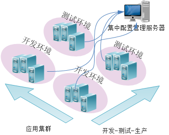
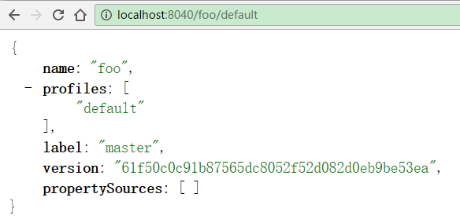
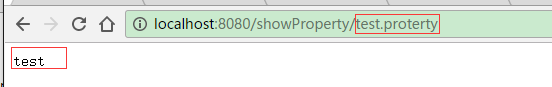

# oss-configserver 介绍

configserver是一个配置中心  

分布式配置管理应该是分布式系统和微服务应用的第一步.  
想象一下如果你有几十个服务或应用需要配置, 而且每个服务还分为开发, 测试, 生产等不同维度的配置, 那工作量是相当大的, 而且还容易出错.  
如果能把各个应用的配置信息集中管理起来, 使用一套机制或系统来管理, 那么将极大的提高系统开发的生产效率, 同时也会提高系统开发环境和生产环境运行的一致性.  

  

configserver基于spring-cloud-config开发.  
spring-cloud-config由服务器和客户端2部分组成.  
服务器管理各个应用/服务在所有环境下的外部属性.  
客户端从服务器获取数据并构造出Spring Environment和PropertySrouce, 所以非常适合Spring应用.  
服务器使用RESTful接口, 所以可以在任何语言开发的任何应用中使用.

## configserver 的特性

1. 支持yaml配置.  
  1.1. 相对于properties文件, yaml可以将相关的配置项分组(层次), 使用缩进而不用每行都前缀, 更易阅读.  
  1.2. 相对于properties文件, yaml类似于xml但比xml简单很多, 表达list/array等结构化数据的能力更强, 对注释的支持也更好.  
  1.3. 相对于一组properties文件, yaml可以将多个环境(multi-profile)的配置放在一个文件中, 方便维护.  
  1.4. 多环境一致的公共配置只需在前面写一份, 后面各个profile中不用重复.  
  1.5. 也可以把默认配置写在前面, 后面各个profile仅需覆写有变化的配置项即可.

2. 支持公司全局的公共配置.  
  2.1. 全局公共配置可以减少应用配置的工作量.  
  2.2. 全局公共配置方面管理公用的底层服务, 如唯一id, 短域名, 缓存等, 应用无需各种重复这些配置, 集群变更时只需要统一改一个地方.

3. 使用git管理配置文件.  
  3.1. 配置文件的版本(修改)可追溯.  
  3.2. 可以立即切换到任意版本的配置, 上线出现问题时非常容易回退.  
  3.3. 每个项目由项目组自行管理配置文件.

4. 安全认证.  
  4.1. 每个项目有自己的密码, 其它人看不到配置信息.  
  4.2. 管理员可以管理用户密码.

5. 配置项加密.  
  5.1. 可以在代码开源的同时, 将敏感配置项加密, 促进代码开源, 同时不会泄密.  
  5.2. 即使代码泄露到外网也不会造成严重安全隐患.

6. 与服务发现无缝集成, 可通过服务发现使用configserver.

7. 支持运行时配置更新.

[YML配置介绍](INTRODUCTION_OF_YML.html)

## configserver 的地址
http://oss-configserver.internal:8888/config  


## 如何使用configserver

### 1. 新建maven工程

pom.xml:

    <project xmlns="http://maven.apache.org/POM/4.0.0" xmlns:xsi="http://www.w3.org/2001/XMLSchema-instance" xsi:schemaLocation="http://maven.apache.org/POM/4.0.0 http://maven.apache.org/xsd/maven-4.0.0.xsd">
        <modelVersion>4.0.0</modelVersion>
    
        <parent>
          <groupId>org.yirendai.infra</groupId>
          <artifactId>oss-build</artifactId>
          <version>${oss-build.version}</version>
        </parent>
    
        <groupId>com.yirendai</groupId>
        <artifactId>foo</artifactId>
        <version>0.0.1-SNAPSHOT</version>
        <packaging>jar</packaging>
    
        <properties>
            <spring-boot.version>1.4.1.RELEASE</spring-boot.version>
        </properties>
    
        <dependencyManagement>
            <dependencies>
                <dependency>
                    <groupId>com.yirendai.infra</groupId>
                    <artifactId>oss-release-spring-boot-${spring-boot.version}</artifactId>
                    <version>${oss-release.version}</version>
                    <type>pom</type>
                    <scope>import</scope>
                </dependency>
            </dependencies>
        </dependencyManagement>
    
        <dependencies>
          <dependency>
            <groupId>org.springframework.cloud</groupId>
            <artifactId>spring-cloud-starter-config</artifactId>
          </dependency>
          <dependency>
            <groupId>org.springframework.boot</groupId>
            <artifactId>spring-boot-starter-web</artifactId>
          </dependency>
          <dependency>
            <groupId>org.springframework.boot</groupId>
            <artifactId>spring-boot-starter-jetty</artifactId>
          </dependency>
          ...
        </dependencies>
    </project>


src/main/java/FooApplication.java:
```
@SpringBootApplication
@RefreshScope // 带此注解支持动态更新配置
@RestController
public class FooApplication {

  @Autowired
  private Environment environment;
    
  @RequestMapping("/getProperty/{key:.+}")
  public String getProperty(@PathVariable String key) {
    return environment.getProperty(key);
  }
    
  public static void main(String[] args) {
    SpringApplication.run(FooApplication.class, args);
  }
}
```

src/main/resources/bootstrap.yml
```
spring.application:
  name: foo

eureka:
  instance:
    client:
      serviceUrl:
        defaultZone: http://local-eureka:8761/eureka/  # 使用eureka发现configserver的地址

spring.cloud:
  config:
    enabled: true
    discovery:
      enabled: true
      serviceId: local-configserver
    failFast: true
    name: foo                                       # 应用的名字(配置git repository的名称前缀)
    label: master                                   # 配置git repository的分支
    profile: ${ENV:development}.env                 # 配置的profile
    username: ${CONFIG_SERVER_USERNAME:user}        # 用户名永远为user
    password: ${CONFIG_SERVER_PASSWORD:user_pass}   # 密码需要向基础架构申请
```

### 2. 向基础架构组申请应用密码

需提交应用名称, 密码可以自己定好也可以由基础架构提供随机密码.

此步骤主要是为了:  
1.避免应用/服务名称冲突.  
2.每应用一个密码增加安全性.  
3.帮助开发人员创建git仓库并设置deploy key以供configserver访问.

### 3. 准备配置文件

存储配置文件的git仓库统一放在一个group (目前是: http://gitlab.internal/groups/configserver) 下面.  
命名规则是: 以应用名称作为git repository的名称前缀, 后面加上-config.
例如:
应用名称(spring.application.name)为: foo  
那么配置git仓库就是: http://gitlab.internal/groups/configserver/foo-config

clone 配置git仓库 `git clone git@gitlab.internal:configserver/foo-config.git`  
创建application.yml
```
# foo-config
# 注意格式 不要用tab

server:
  port: 8080

test.property: default

---
spring:
  profiles: prodection.env # 生产环境

test.property: production.env

---
spring:
  profiles: development.env # 开发环境

test.property: development.env
```
提交配置文件 `git add . && git commit -m 'foo config' && git push origin master`

此时访问configserver应该可以看到配置信息.  
例如: 在浏览器里打开  
http://${configserver-host}:8888/config/foo/default/master  
或  
http://${configserver-host}:8888/config/foo/development.env/master  
可以看到类似下图的信息.  
  
可以对比观察一下不同环境下配置信息的差异.

注意:  
configserver会自动加载通用配置(如不同环境下一些基础服务的地址等设置), 这些配置对全部项目有效, 项目中可以直接使用(如 @Value), 如下图:  


### 4. 运行 FooApplication 的main方法

访问 http://127.0.0.1:8080/getProperty/${key} 可以发现配置已经读到了程序中, 如下图.  


到这里, configserver就配置好了.
