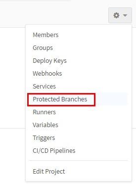
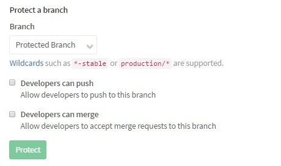
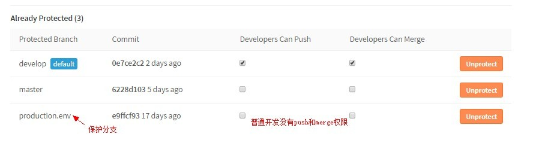
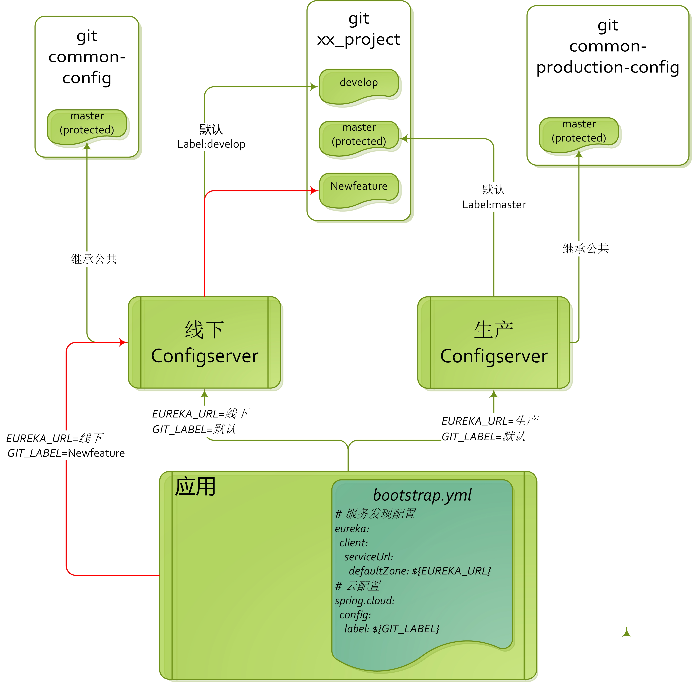

# 关于configserver的安全机制

## 权限管理

### git存储配置,权限角色依赖gitlab权限
[公司gitlab权限详细介绍](http://gitlab.internal/help/user/permissions)

配置git库权限 | gitlab权限 | 公司角色
:---:|:---:|:---:
查看者 | Guest/Reporter | QA/测试 
修改者 | Developer | 开发人员
上线管理者 | Master | 技术经理/运维
configserver管理者 | Owner | 基础架构组管理

+ 配置查看者
    > - 可查看代码的配置项
    > - 发现配置问题,可提出issue
    > - 由于敏感信息已经加密,所以无法看到明文,保证安全

+ 配置修改者
    > - 开发人员在非保护分支(非master)自由修改配置,线下充分测试后提交
    > - 根据需求,创建不同分支并行开发
    > - 发起保护分支的merge请求

+ 上线管理者
    > - 线上发布的是受保护分支(production.env),主动修改后push配置,配置生效
    > - 同意开发的merge请求,配置生效
    > - 添加其他成员

+ configserver管理者
    > - 检查项目名称
    > - 创建git项目,指定受保护分支(默认master,可增加预发布分支)
    > - 分配管理权限,指定"上线管理者"

## 如何配置git权限
gitlab选择保护分支

选择需要保护的分支

配置成功后显示

## 环境结构参考

